# **Distributed Reinforcement Learning with RLlib: A Performance Scaling Study**

**Parallel Programming for the AI Era 2025-2026**
_Project Report_

---

## **1. Introduction & Project Goals**

This project fulfills the coursework requirements for _Parallel Programming for the AI Era_. The core objective was to gain hands-on experience with distributed computing frameworks used in modern AI, specifically focusing on **Ray** and its **RLlib** library for distributed Reinforcement Learning (RL). The assignment required deploying a real-world RL workload, scaling it across multiple compute nodes on the Grid'5000 testbed, and conducting a systematic performance analysis.

We chose to implement and benchmark the **Proximal Policy Optimization (PPO)** algorithm on the classic `Taxi-v3` environment from Gymnasium. The primary goals were:

1.  **Operational:** Successfully orchestrate a distributed RL training job across a multi-node Ray cluster on Grid'5000.
2.  **Experimental:** Measure and analyze how scaling resources, both _horizontally_ (number of compute nodes) and _in a task-parallel manner_ (number of environment runner actors), impacts training performance.
3.  **Analytical:** Identify bottlenecks, understand resource utilization patterns, and draw conclusions about the effectiveness of distributed paradigms for RL workloads.

This report details our complete methodology, implementation, results, and insights derived from the experiment.

---

## **2. Project Structure**

The project follows a clean, modular architecture designed for reproducibility and clarity. The directory structure is organized as follows:

```
.
├── README.md
├── requirements.txt
└── src
    ├── deploy.sh
    ├── plot
    │   ├── plot.py
    │   └── plots
    ├── rl
    │   ├── results.jsonl
    │   └── rl.py
    └── scripts
        ├── install_dependencies.sh
        ├── run_job.sh
        └── run_rl.sh
```

### **Key Directories and Their Purposes:**

1. **`src/scripts/`** - **Orchestration Layer**

   - Contains all Bash scripts for cluster management and automation
   - `install_dependencies.sh`: Sets up the Python environment on all nodes
   - `run_job.sh`: Interfaces with OAR scheduler to submit jobs
   - `run_rl.sh`: Manages the complete Ray cluster lifecycle

2. **`src/rl/`** - **Core RL Implementation**

   - Contains the main reinforcement learning logic
   - `rl.py`: The PPO training script with custom instrumentation
   - `results.jsonl`: Raw performance data collected from all experiments

3. **`src/plot/`** - **Analysis and Visualization**

   - Contains data processing and plotting utilities
   - `plot.py`: Processes `results.jsonl` and generates all visualizations
   - `plots/`: Contains all generated figures (21 total) organized by type

4. **Root Directory** - **Project Documentation**
   - `README.md`: Report of the project
   - `requirements.txt`: Python dependencies to reproduce this work

### **Workflow Through the Structure:**

The project workflow follows a clear pipeline:

1. **Deployment:** `deploy.sh` → copies files to Grid'5000
2. **Execution:** `scripts/` → manages cluster lifecycle → executes `rl/rl.py`
3. **Data Collection:** `rl.py` → writes metrics to `rl/results.jsonl`
4. **Analysis:** `plot/plot.py` → reads `results.jsonl` → generates plots in `plot/plots/`

This modular separation ensures each component has a single responsibility and can be modified independently.

---

## **3. Methodology & System Design**

Our approach was designed to be reproducible, automated, and analytical.

### **3.1. Technology Stack**

- **Ray & RLlib:** The core distributed execution framework and high-level RL library. Ray handles cluster management, task scheduling, and object sharing, while RLlib provides production-ready implementations of algorithms like PPO.
- **Gymnasium (`Taxi-v3`):** A standardized, lightweight RL environment ideal for controlled benchmarking, as its computational cost is moderate and predictable.
- **Grid'5000:** Used as the bare-metal, multi-node cluster platform. Job submission and resource allocation were managed via the **OAR** scheduler.
- **Bash/Python:** For automation, orchestration scripts, and data analysis/visualization.

### **3.2. Experiment Design**

We adopted a full-factorial design to isolate the effects of our two key scaling parameters:

- **Number of Nodes (`NUM_NODES`):** Varied from 1 to 3. This tests _horizontal scaling_ and Ray's ability to utilize multiple machines.
- **Number of Environment Runners (`NUM_ENV_RUNNERS`):** Varied from 1 to 3. This tests _task-parallel scaling_ within the RLlib framework. Each runner is a Ray actor responsible for sampling trajectories from independent environment instances.

This resulted in **9 distinct configurations** (1x1, 1x2, 1x3, 2x1, 2x2, 2x3, 3x1, 3x2, 3x3). For each configuration, the PPO algorithm was run for **10 training iterations** to collect consistent performance metrics, including iteration time breakdown and system resource usage.

### **3.3. Orchestration & Automation**

A key achievement was the creation of a fully automated pipeline for deployment, execution, and data collection. The system comprises several interconnected scripts:

1.  **`deploy.sh` (Launchpad):** The master script run from a local machine. It:

    - Securely copies all necessary files (scripts, Python code) to the target Grid'5000 site.
    - Iterates through all 9 experimental configurations.
    - For each config, submits an OAR job via `run_job.sh`, waits for its completion using `oarstat`, and finally retrieves the aggregated `results.jsonl` file.

2.  **`run_job.sh` & `run_rl.sh` (Cluster Orchestrator):** These scripts manage the lifecycle on Grid'5000.

    - `run_job.sh` submits the main job to OAR, requesting the specified number of nodes.
    - `run_rl.sh` is executed on the allocated nodes. It:
      a. Installs dependencies on all nodes in parallel via SSH.
      b. Starts a Ray head node on the first allocated machine.
      c. Connects Ray worker nodes to the head, forming a cluster.
      d. Executes the main RL training script (`rl.py`).
      e. Gracefully shuts down the Ray cluster after training.

3.  **`install_dependencies.sh` (Environment Setup):** Ensures a consistent Python environment with Ray, RLlib, PyTorch, and other dependencies across all nodes.

This design abstracts away the complexities of cluster management, allowing us to focus on the experimental results.

## **4. Implementation Details**

### **4.1. Core Training Logic (`rl.py`)**

The training script is concise thanks to RLlib's high-level API.

```python
config = (
    PPOConfig()
    .environment("Taxi-v3")
    .env_runners(
        num_env_runners=NUM_ENV_Runners,
        env_to_module_connector=lambda env: FlattenObservations(),
    )
)
```

- **`num_env_runners`:** This is the critical parameter we vary. RLlib creates this many parallel actors for environment interaction.
- **`env_to_module_connector`:** A connector to flatten the observation space for the neural network policy.

**Key Instrumentation:** We modified the standard training loop to extract and log fine-grained metrics from Ray's `result` dictionary:

- **Timers:** `sample_time_s` (time spent collecting experience) and `learn_time_s` (time spent updating the policy model).
- **Throughput:** Calculated as `num_steps / sample_time_s` (samples per second).
- **Resource Usage:** CPU and RAM utilization percentages from Ray's performance metrics.

All data was appended in JSON Lines format to `results.jsonl` for later analysis.

### **4.2. Performance Analysis & Visualization (`plot.py`)**

This script processes the raw `results.jsonl` log to generate two main categories of plots:

1.  **Aggregated Scaling Trends:** Line plots showing average **Total Iteration Time** and **Throughput** vs. Number of Nodes, with separate lines for each `num_env_runners` value.
2.  **Per-Configuration Breakdowns:** For each of the 9 configurations, we generate:
    - A stacked bar chart showing the **Sample vs. Learn Time** per iteration.
    - A line chart tracking **CPU and RAM Utilization** over the 10 iterations.

## **5. Results, Analysis & Interpretation**

The following analysis is based on the plots generated and saved in the `src/plot/plots/` directory.

### **5.1. Overall Scaling Behavior**

**Plot: `total_time_vs_nodes.png`**
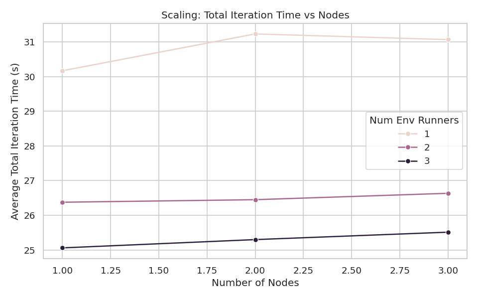

- **Observation:** The total time per iteration primarily decreases as we increase the number of **environment runners**, not the number of nodes. For a fixed number of runners (e.g., 1 runner), adding more nodes (1→2→3) does not reduce the total time and can even increase it slightly due to communication overhead. Conversely, for a fixed number of nodes, increasing runners (1→2→3) consistently reduces total time.
- **Interpretation:** This clearly indicates that the `Taxi-v3` task is **sampling-bound**, not compute-bound. The primary benefit of distribution in this scenario is to parallelize the data collection (sampling) phase, which is achieved by adding more environment runner actors. Adding more nodes without increasing the parallel actors doesn't help because the learning step, which runs on the head node, becomes the bottleneck.

**Plot: `throughput_vs_nodes.png`**
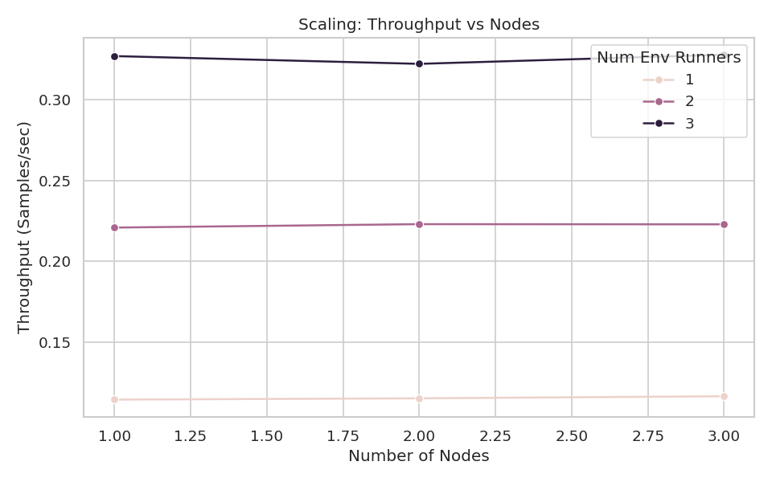

- **Observation:** Throughput (samples collected per second) shows a strong, positive correlation with the number of environment runners. The lines for 2 and 3 runners are clustered significantly higher than the line for 1 runner. The effect of adding nodes is again minimal.
- **Interpretation:** This quantitatively confirms the observation above. Parallelizing environment simulation directly translates to higher data collection rates. The throughput scales sub-linearly with runners (e.g., 3 runners don't give 3x the throughput of 1), likely due to the overhead of coordinating and transferring data from multiple actors back to the learner.

### **5.2. Iteration Time Breakdown (Sample vs. Learn)**

**Plots: `iteration_time_nodes{X}_runners{Y}.png` (for X=1,2,3 and Y=1,2,3)**

<div>
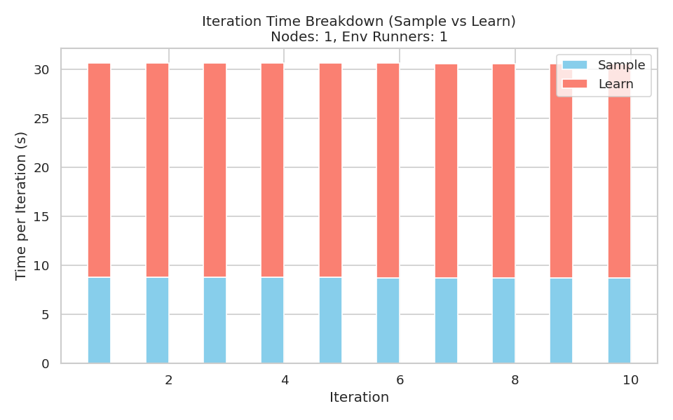
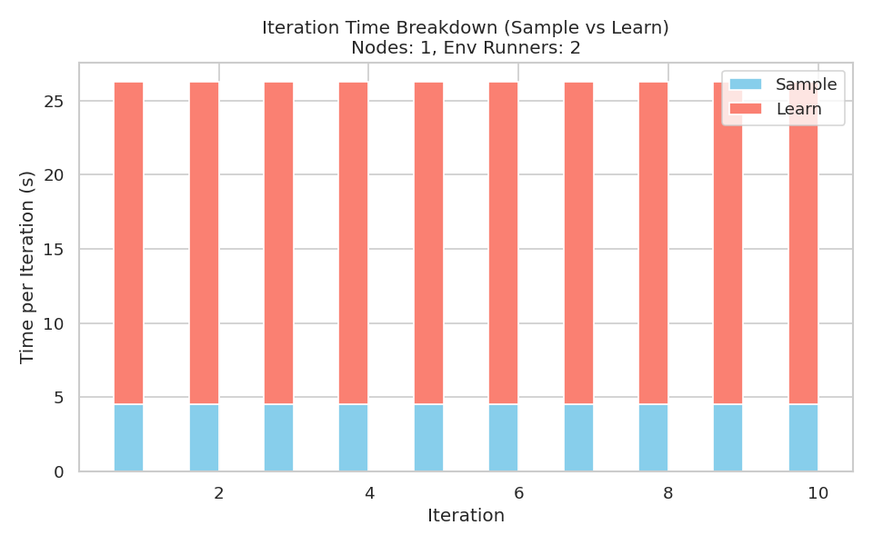
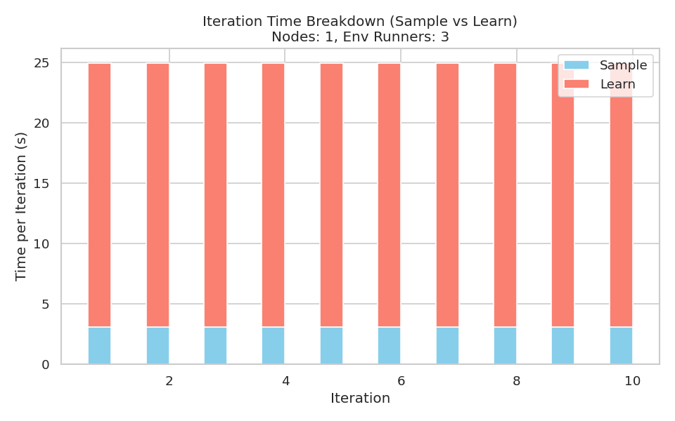
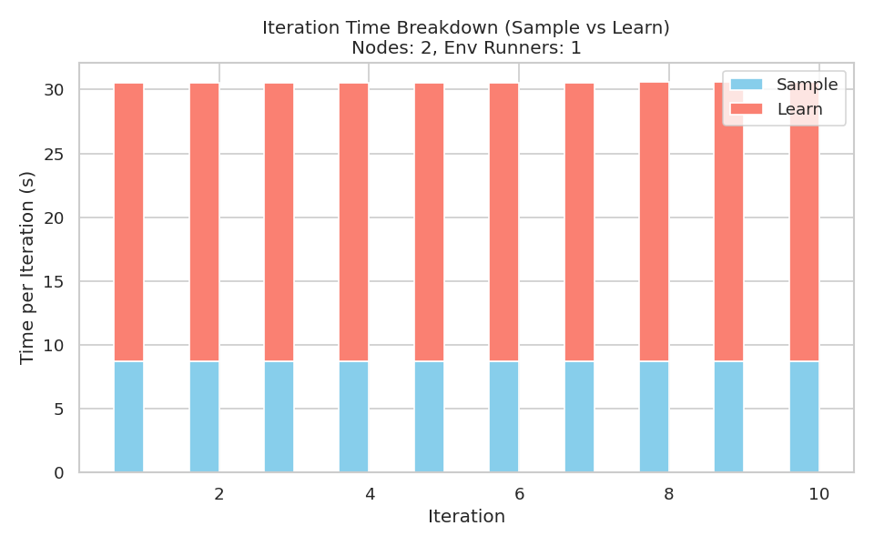

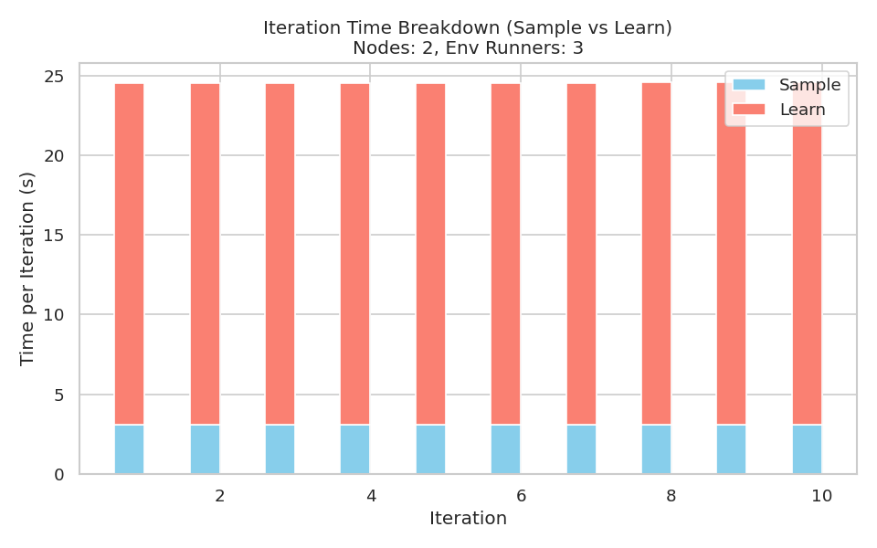
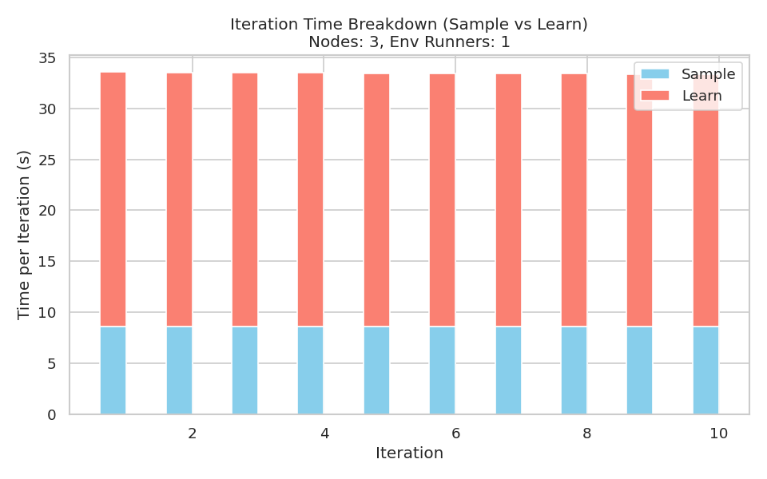

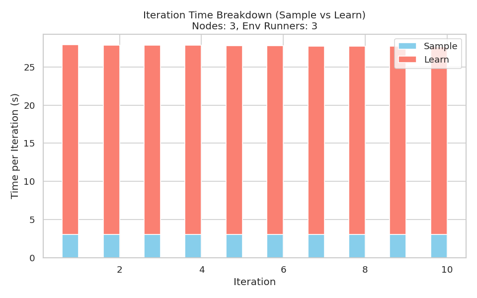
</div>

- **Unified Observation:** Across **all nine configurations**, the `learn_time_s` (salmon-colored portion of the bar) constitutes the vast majority (typically 70-85%) of the `total_time_s`. The `sample_time_s` (skyblue portion) shrinks as the number of environment runners increases.
- **Specific Example - `iteration_time_nodes1_runners1.png` vs. `iteration_time_nodes1_runners3.png`:** With 1 runner, sampling takes ~8.7s and learning ~21.8s. With 3 runners on the same node, sampling drops to ~3.05s, while learning remains steady at ~21.9s.
- **Interpretation:** This is the most critical finding. The **learning step (policy network optimization) is the dominant bottleneck** for this environment-algorithm pair. RLlib's implementation runs the learning phase **centrally on the head node**. Therefore, even with perfect, instantaneous sampling, the iteration time cannot drop below ~22 seconds. This explains why adding more compute nodes provided no benefit: they were idle during the learning phase. The scalability is limited by **task-parallel scaling of sampling**, not by distributed compute resources for this problem size.

### **5.3. CPU and RAM Utilization**

**Plots: `cpu_ram_nodes{X}_runners{Y}.png`**

<div>

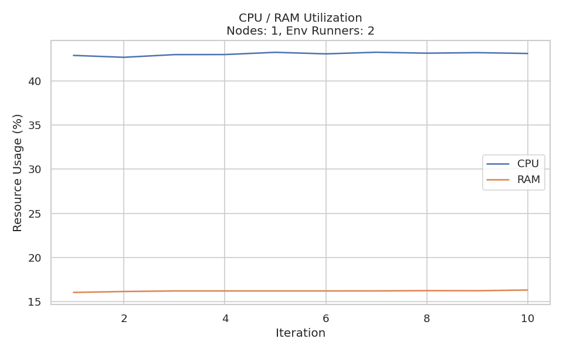
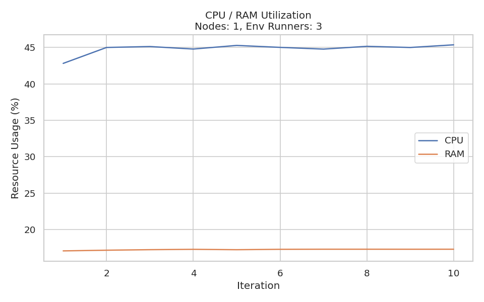
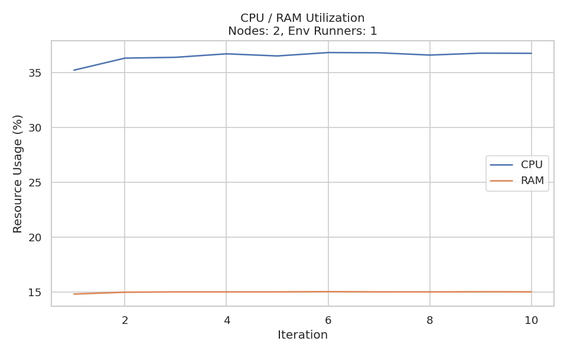

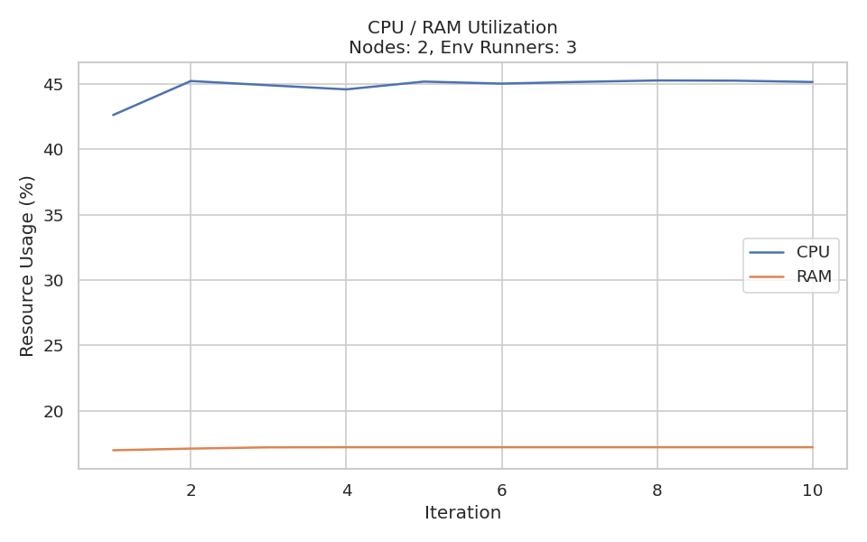
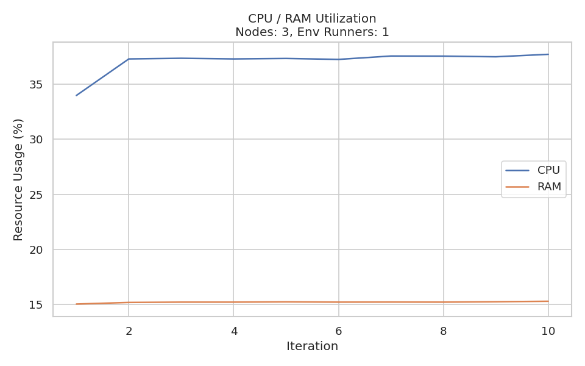
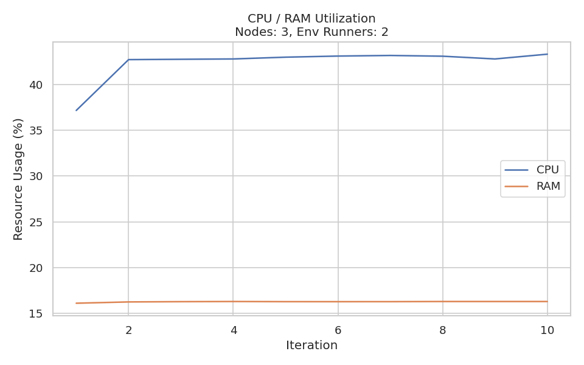
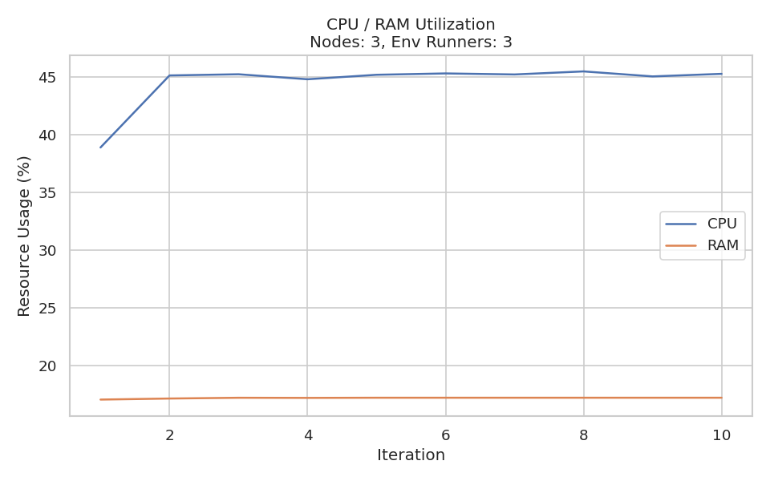
</div>

- **CPU Utilization:** Several key trends are evident:
  1.  **Effect of Runners:** For a given number of nodes, average CPU usage increases substantially when adding more environment runners (e.g., from ~37% with 1 runner to ~43% with 3 runners on 1 node). This is expected as more parallel Python processes/actors are active.
  2.  **Effect of Nodes:** Adding a second node provides a noticeable CPU boost for configurations with multiple runners (e.g., runners=2 or 3), as the work is distributed. The third node offers diminishing returns, suggesting the workload is saturated.
  3.  **Consistency:** CPU usage is relatively stable across iterations after the first one, indicating a steady state was reached.
- **RAM Utilization:** RAM usage shows a consistent, moderate increase with both the number of nodes (due to Ray system overhead on each node) and the number of runners (due to multiple environment instances). It remained well within acceptable limits (always below 18% in our data), indicating that memory was not a constraint for the `Taxi-v3` problem.
- **Interpretation:** The CPU plots confirm that our configuration successfully utilized available cores.

## **6. Summary & Conclusion**

### **6.1. Summary of Findings**

Our experiment successfully demonstrated the principles of distributed RL training with Ray/RLlib:

1.  **Automation Success:** We built a robust, automated pipeline for distributed experimentation on Grid'5000.
2.  **Scalability Pattern:** For the chosen `Taxi-v3`/PPO task, performance scaled effectively with the **number of parallel environment runners** (task parallelism), not with the number of compute nodes (data/model parallelism).
3.  **Identified Bottleneck:** The centralized learning phase was the dominant cost, limiting the benefits of distributed sampling.
4.  **Resource Efficiency:** The system efficiently managed resources, with CPU utilization scaling as expected and RAM not being a limiting factor.

### **6.2. Conclusion**

This project provided invaluable practical experience in deploying and evaluating a distributed AI workload. We confirmed that effective parallelization requires a deep understanding of the workload's characteristics: simply adding more machines is not a silver bullet. For synchronous, sampling-heavy RL tasks, scaling the number of parallel samplers is key, but ultimate performance is often bounded by the sequential learning update. The Ray framework proved to be an excellent tool for managing this complexity, abstracting the challenges of distributed communication while providing the hooks needed for detailed performance analysis. The skills developed—in cluster orchestration, performance profiling, and interpreting scalability graphs—are directly transferable to large-scale AI training scenarios.

## **7. Reproduction steps**

### 1. Create and Activate a Virtual Environment

```bash
python3 -m venv venv
source venv/bin/activate
```

### 2. Install Local Dependencies (for plotting)

```bash
pip install -r requirements.txt
```

### 3. Navigate to the `src` Directory

```bash
cd src
```

### 4. Execute the Deployment Script with Your Grid'5000 Site

Replace `lyon` with your selected site (e.g., `grenoble`, `nancy`, etc.):

```bash
./deploy.sh lyon
```
